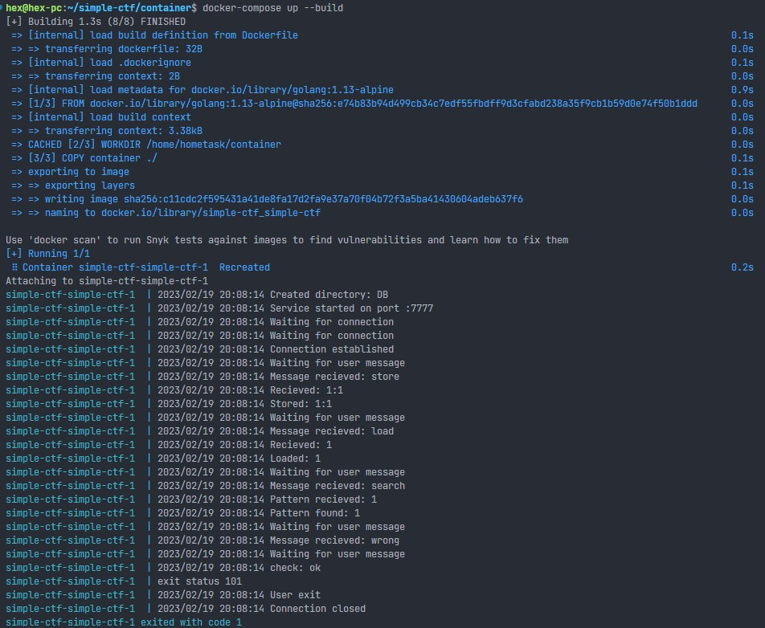

# TCP server and client

Command line tool for simple CTF game, includes Server and Client. Wrapped in docker, example:

Server commands:

- store: stores values by key
- load: returns value by key
- search: lists keys by given line

Client commands:

- check: complete check for server
- get: check that value is obtainable by key
- put: check that key and value are stored on the server
- search: check to find key or keys
